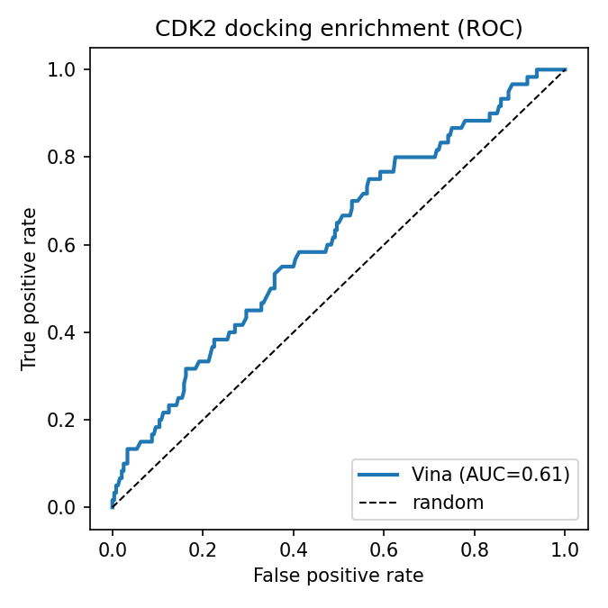
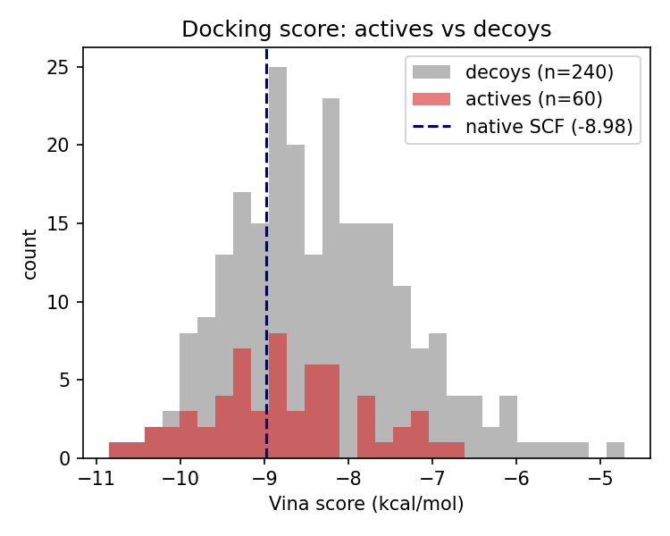
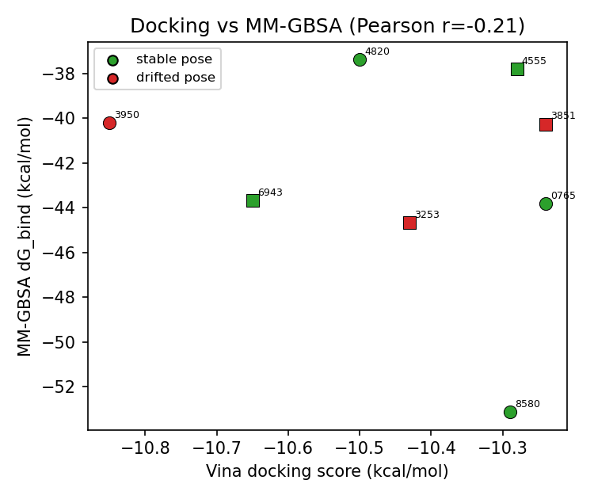
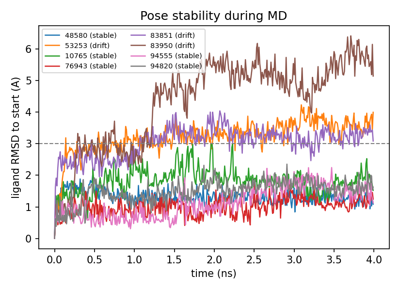
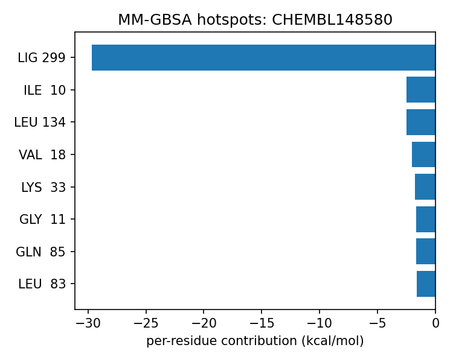
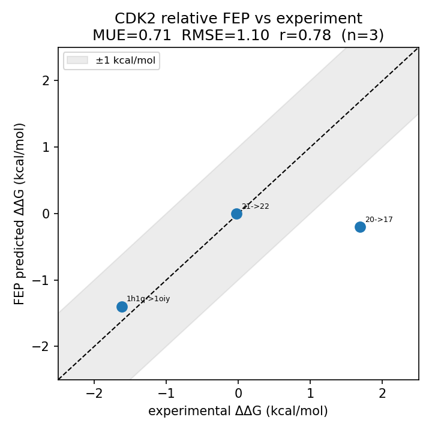

# CDK2 Structure-Based Virtual Screening — Docking → MD → MM-GBSA → FEP

> **Self-initiated practice project.** A complete, scriptable, reproducible computational
> pipeline for structure-based virtual screening against **cyclin-dependent kinase 2 (CDK2)**.
> The goal is to demonstrate an end-to-end CADD workflow with *honest method validation* —
> **not** to claim discovery of novel inhibitors.

---

## TL;DR

- **Target:** CDK2, ATP-competitive site. Crystal structure **PDB `2R3I`** (1.28 Å, monomeric).
- **Library:** 300 ligands — 60 known CDK2 actives + 240 property-matched decoys (DUD-E; a live
  ChEMBL path is also provided).
- **Pipeline:** rigid-receptor docking (**AutoDock Vina**) → physical filtering by short MD
  (**OpenMM**, explicit solvent, RTX 4090) → endpoint free-energy rescoring (**MM-GBSA**,
  AmberTools) → ranking & per-residue analysis.
- **Docking enrichment:** ROC-AUC **0.61**, EF₁% **3.3** — modest but real, and improved by the
  physics-based rescoring of the top hits.
- **Relative binding FEP** (OpenFE, on the JACS/Wang-2015 CDK2 benchmark): 3 alchemical edges vs
  experiment — MUE **0.71**, RMSE **1.1**, Pearson **r = 0.78**.

The scientific question is deliberately modest and *checkable*: **how much does each added layer
of physics (MD pose filtering, then MM-GBSA) change the ranking of the top docking hits, and how
well does docking alone recover known actives from property-matched decoys?**

---

## Why CDK2

CDK2 is a textbook structure-based design target and a clean choice for a methods demo:

- **Well-defined, deep ATP pocket** at the kinase hinge — docking behaves well here, unlike
  shallow / solvent-exposed sites.
- **Non-covalent, ATP-competitive inhibitors dominate** — matching the assumptions of docking
  and MM-GBSA (no covalent-warhead confounder, unlike e.g. SARS-CoV-2 Mpro).
- **Abundant, consistent public bioactivity data** for enrichment validation.
- **Monomeric ~300-residue system** — small enough for short explicit-solvent MD on one GPU.

Structure `2R3I` was chosen for its ultra-high resolution (1.28 Å) and a drug-like
pyrazolo[1,5-a]pyrimidine inhibitor (`SCF`) at the ATP site. An oxidized cysteine `CSD177`
(a crystallization artifact) is reverted to `CYS`, and a disordered β3/αC loop (res 46–52,
distal to the pocket) is rebuilt so the MD topology has no chain break.

---

## Pipeline

```
PDB 2R3I ─┐
          ├─▶ 0. Receptor prep (clean chain A, CSD→CYS, rebuild loop, protonate, define box)
DUD-E   ──┘        │
ChEMBL ───────▶ 1. Ligand library (60 actives + 240 matched decoys → 3D → PDBQT)
                   │
                   ▼
          2. Docking (AutoDock Vina)  ──▶  ROC / enrichment vs known actives + native redock control
                   │   top-8 hits
                   ▼
          3. Short MD (OpenMM, explicit solvent, 4 ns)  ──▶  ligand-RMSD pose-stability filter
                   │
                   ▼
          4. MM-GBSA rescoring (AmberTools MMPBSA.py) + per-residue decomposition
                   │
                   ▼
          5. Final analysis: docking vs MM-GBSA ranking, pose stability, binding hotspots

   (validation track) Relative binding FEP — OpenFE, JACS CDK2 benchmark ──▶ predicted vs exp ΔΔG
```

---

## Results

### Docking enrichment (300 ligands: 60 actives / 240 matched decoys)

| Metric | Value |
|--------|-------|
| ROC-AUC | **0.613** |
| Enrichment factor @1% | **3.33** |
| Enrichment factor @5% | 2.33 |
| Enrichment factor @10% | 1.50 |
| Active mean score | −8.76 kcal/mol |
| Decoy mean score | −8.34 kcal/mol |
| Native SCF redock (control) | −8.98 kcal/mol (ranks top 31%) |

 

Single-conformation rigid docking gives **modest but real** enrichment (AUC 0.61, with the
strongest early enrichment at 1%). The top docking hits are a mix of actives and decoys —
exactly the situation that motivates re-scoring the top hits with more physics.

*Note on the redock control:* the native SCF re-docks with a strong score (−8.98 kcal/mol);
a pose-RMSD-to-crystal was not computed because the crystal ligand carries dual alternate
conformations with no connectivity records (ambiguous bond perception), so the score + rank is
used as the positive control instead.

### MD pose stability + MM-GBSA rescoring (top 8 docking hits)

The 8 top-Vina hits (4 actives, 4 decoys) were each run through 4 ns of explicit-solvent MD and
rescored with MM-GBSA. **5 of 8 poses stayed stable; 3 drifted** (ligand RMSD-to-start grew past
3 Å).

| Ligand | Class | Vina | MM-GBSA ΔG (kcal/mol) | Pose stable? |
|--------|-------|------|-----------------------|--------------|
| CHEMBL148580  | active | −10.29 | **−53.1 ± 5.3** | ✅ |
| C14253253     | decoy  | −10.43 | −44.7 ± 3.3 | ❌ drift (→4.0 Å) |
| CHEMBL210765  | active | −10.24 | −43.8 ± 4.3 | ✅ |
| C12376943     | decoy  | −10.65 | −43.7 ± 3.5 | ✅ |
| C24583851     | decoy  | −10.24 | −40.3 ± 3.9 | ❌ drift |
| CHEMBL183950  | active | −10.85 | −40.2 ± 6.2 | ❌ drift (→5.1 Å) |
| C27794555     | decoy  | −10.28 | −37.8 ± 2.7 | ✅ |
| CHEMBL1094820 | active | −10.50 | −37.4 ± 3.8 | ✅ |

 

**What each physics layer adds:**
- **Re-ranking:** across these eight already-well-docked hits the Vina score (a narrow −10.2…
  −10.9 band) carries little ranking information; MM-GBSA spreads them over ~16 kcal/mol and puts
  a genuine active (CHEMBL148580, −53 kcal/mol) at the top.
- **False-positive filtering:** the pose MM-GBSA ranked #2 (decoy C14253253) **drifts out of the
  pocket during MD** (RMSD → 4 Å) and would be discarded — a high-scoring artifact caught only by
  dynamics. The #1 *docking* hit (active CHEMBL183950) also drifts (→5 Å), a reminder that a top
  docking score does not guarantee a stable binding mode.
- **Mechanism:** per-residue MM-GBSA decomposition localises binding to the CDK2 hinge
  (Gln131 / Asn132 / Leu134), the catalytic Lys33 and the Gly-rich/β-sheet residues lining the
  ATP cleft — consistent with known CDK2 pharmacophores.



*Honest reading:* with only 4 actives / 4 decoys advanced and uncalibrated absolute MM-GBSA
energies, this is a methods demonstration rather than a benchmark — but each layer behaves as
theory predicts, and the combined docking → MD → MM-GBSA funnel ends on a real active.

### Relative binding FEP vs experiment (OpenFE)

As a higher-tier validation, relative binding free energies were computed with **OpenFE**
(OpenMM hybrid-topology RBFE + Hamiltonian replica exchange + MBAR) on the standard
**JACS / Wang-2015 CDK2 benchmark**, whose experimental IC₅₀s give reference ΔΔG. Three
alchemical edges were run (1 repeat, 11 λ-windows, 5 ns/window per leg):

| Edge (A→B) | FEP ΔΔG | Exp. ΔΔG |
|------------|---------|----------|
| lig_1h1q → lig_1oiy | −1.4 | −1.62 |
| lig_21 → lig_22     |  0.0 | −0.03 |
| lig_20 → lig_17     | −0.2 | +1.69 |

**MUE = 0.71 · RMSE = 1.10 · Pearson r = 0.78 (n = 3).**



Two of three edges land within ~0.2 kcal/mol of experiment (including the near-zero
sanity-check edge `lig_21→lig_22`); the third (`lig_20→lig_17`) is a clear miss — expected for a
single-repeat, 5 ns RBFE run and an honest illustration that individual edges can fail to
converge. This is a **3-edge methods demonstration, not a benchmark**: production FEP uses ≥3
repeats over a full edge network for reliable error bars. The protocol itself is the
community standard (see [References](#references-methods)).

---

## Reproduce

```bash
# environment (Linux + conda/mamba; CUDA build of OpenMM must match the GPU driver)
conda env create -f env/cadd_env.yml && conda activate cadd

WD=$PWD
python scripts/00_prepare_receptor.py --workdir $WD --pdb 2R3I --box-min 22.5
python scripts/01_fetch_ligands.py    --workdir $WD --source dude     # or --source chembl
python scripts/02_dock.py             --workdir $WD --exhaustiveness 8 --cpus 16
python scripts/03_analyze_docking.py  --workdir $WD

# MD + MM-GBSA for the top hits (needs a GPU; run under SLURM)
TOPN=8 NS=4 sbatch slurm/md_pipeline.slurm
python scripts/07_final_analysis.py   --workdir $WD
```

Relative binding FEP (separate `fep` env; GPU via SLURM), on the JACS CDK2 benchmark:

```bash
conda env create -f env/fep_env.yml && conda activate fep
# benchmark ligands.sdf + protein.pdb come from openff protein-ligand-benchmark (data/cdk2)
openfe plan-rbfe-network -M ligands.sdf -p protein.pdb -o network_setup --n-protocol-repeats 1
TRANSFORMS="rbfe_lig_21_solvent_lig_22_solvent rbfe_lig_21_complex_lig_22_complex" \
    sbatch slurm/fep_run.slurm          # repeat per edge (1 solvent + 1 complex leg each)
python scripts/08_fep_analysis.py --fepdir <fep_workdir>
```

---

## Engineering notes (real problems solved)

A faithful record of the non-trivial issues hit while making this run end-to-end:

- **ChEMBL API outage / fragile property queries.** The live ChEMBL REST API returned 500s on
  float property-range filters and went down mid-run. Switched the default ligand source to the
  static **DUD-E CDK2** benchmark (robust, recognized) while keeping the ChEMBL path as an
  alternative (`--source chembl`).
- **OpenMM CUDA `UNSUPPORTED_PTX_VERSION`.** The conda OpenMM shipped CUDA-12.9 nvrtc while the
  node driver supports CUDA 12.6; pinned `cuda-version=12.6` to realign the JIT PTX.
- **Bond perception from docked PDBQT.** OpenBabel mis-perceived bond orders from the docked pose
  (spurious pentavalent N), crashing ligand parametrization. Reconstruct the ligand with **Meeko**
  (`RDKitMolCreate.from_pdbqt_mol`) directly from the SMILES-annotated PDBQT instead.
- **MMPBSA per-residue selection.** `print_res="within 5"` is rejected by this MMPBSA.py build;
  the pocket residues are now computed explicitly (ligand neighbours) and passed as an integer
  list, with a graceful fall-back to dG-only if decomposition fails.
- **`set -e` swallowed in a `|| ` context.** A `( set -e; … ) || echo` SLURM loop body silently
  disabled `set -e`, so failed setups still ran MD/MM-GBSA; replaced with explicit `&&` chaining.

---

## Limitations & next steps

- Endpoint MM-GBSA is an approximate free-energy method; absolute values are not calibrated and
  only **relative** rankings are meaningful (which is why the rigorous FEP track is included).
- Relative binding FEP is run only as a **3-edge, single-repeat demonstration**; production work
  uses ≥3 repeats over a full edge network for reliable error bars (and `lig_20→lig_17` shows a
  single edge can miss).
- Rigid-receptor docking; protein flexibility is only sampled in the post-docking MD.
- The screening library (300) and FEP edge set (3) are deliberately small for a one-GPU demo;
  scaling both is the obvious production step.

---

## Tools & environment

RDKit · AutoDock Vina · Meeko · OpenBabel · PDBFixer · AmberTools (antechamber, tleap,
MMPBSA.py, cpptraj) · OpenMM (CUDA) · MDAnalysis/MDTraj · **OpenFE** (relative FEP) ·
scikit-learn · matplotlib. Hardware: NVIDIA RTX 4090.

## References / methods

Every stage uses established, peer-reviewed methodology — nothing here is improvised:

- **FEP theory:** Zwanzig, *J. Chem. Phys.* 1954; relative-binding thermodynamic cycle,
  Jorgensen & Ravimohan, *J. Chem. Phys.* 1985.
- **CDK2 FEP benchmark + protocol:** Wang et al., *J. Am. Chem. Soc.* 2015, 137, 2695; dataset
  curation: OpenFF protein-ligand-benchmark (Hahn et al., *LiveCoMS* 2022). Experimental CDK2
  IC₅₀s: Pevarello et al., *J. Med. Chem.* 2004 (doi:10.1021/jm0311442).
- **Estimator / sampling:** MBAR, Shirts & Chodera, *J. Chem. Phys.* 2008; replica-exchange
  multistate, Chodera & Shirts, *J. Chem. Phys.* 2011.
- **Atom mapping:** LOMAP, Liu et al., *J. Comput. Aided Mol. Des.* 2013; Kartograf.
- **Software:** OpenFE (`openfe`); OpenMM, Eastman et al., *PLoS Comput. Biol.* 2017; AmberTools
  MM-GBSA (MMPBSA.py), Miller et al., *J. Chem. Theory Comput.* 2012; AutoDock Vina,
  Trott & Olson 2010 / Eberhardt et al. 2021; GAFF2 + AM1-BCC, Wang et al. 2004 / Jakalian 2002.

## License

MIT — see [LICENSE](LICENSE).
